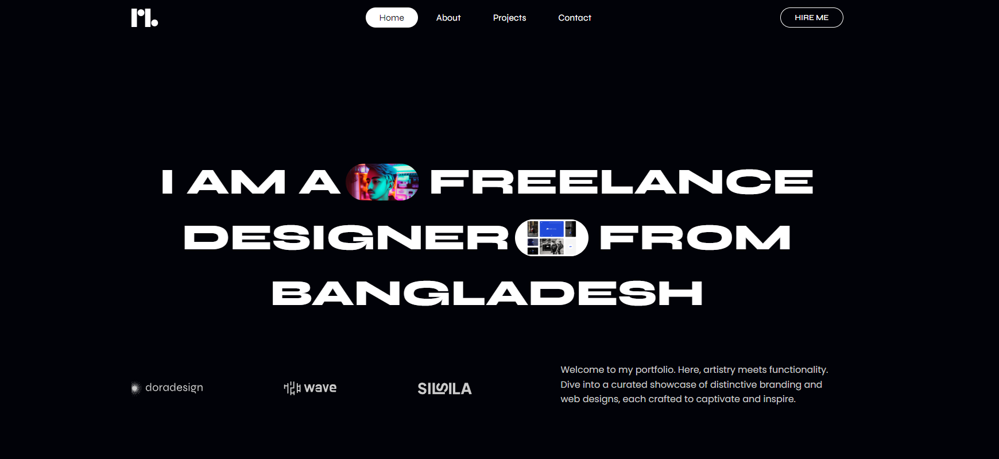

This project is a conversion of a **Figma design into a real website** using **HTML, CSS, and JavaScript**.  
The code is written and organized in **VS Code**.

---

## 🚀 Features
- Responsive layout  
- Semantic HTML structure  
- Styled with CSS  
- Interactive parts with JavaScript  

---

## 🛠️ Tools & Technologies
- HTML5  
- CSS3  
- JavaScript  
- VS Code  
- Figma (for design reference)  

## 📸 Screenshots

### Homepage

---

## 🎨 Figma Design
Original design reference:https://www.figma.com/community/file/1323362736118755647

---

## ▶️ How to Run
1. Clone this repository  
2. Open the folder in **VS Code**  
3. Install the **Live Server** extension  
4. Right-click on `index.html` → **Open with Live Server**  

---

